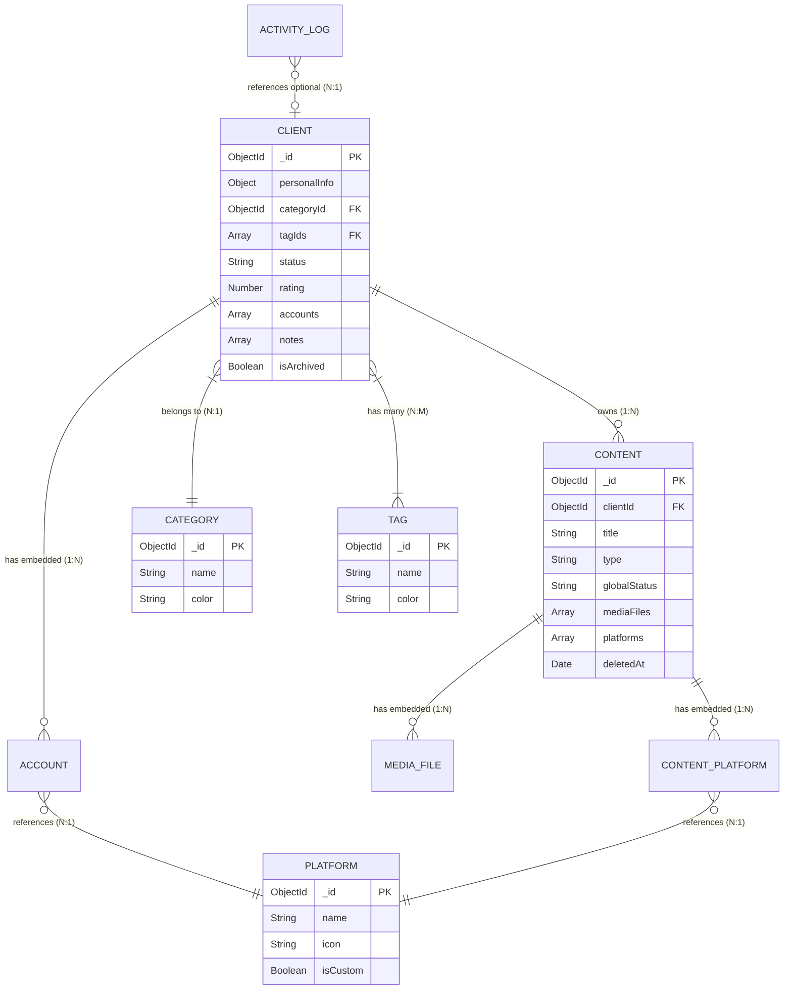

# SMCO-Hub: Database Schema & Entity Relationship Diagram (ERD)

This document provides a comprehensive overview of the MongoDB data structures, Mongoose schemas, and relationships that power the Social Media Content Operations Hub.

---

## 🗺️ Entity Relationship Diagram (ERD)

The following diagram visually maps how the various collections within the database relate to one another.

---

## 🗄️ Detailed Data Dictionaries

Below is the exact structural breakdown of every Mongoose model in the `smco_hub` database.

### 1. `Client` (clients collection)
The core CRM entity. Tracks users and embeds their social media accounts and internal notes.

| Field | Type | Description |
| :--- | :--- | :--- |
| `_id` | ObjectId | Unique identifier. |
| `personalInfo` | Object | Nested object containing `fullName` (required), `phone`, `whatsapp`, `email`, `dob`, and `address`. |
| `categoryId` | ObjectId | Reference to the `Category` collection. |
| `tagIds` | [ObjectId] | Array of references to the `Tag` collection. |
| `status` | String | Enum: `['Active', 'Inactive', 'Lead']`. Default is `Active`. |
| `rating` | Number | Integer between 1 and 10. Default is 5. |
| `ratingNote` | String | Contextual explanation for the current rating. |
| `accounts` | [Object] | Embedded array of Social Accounts. *(See Account Sub-schema below)* |
| `notes` | [Object] | Embedded array containing `{ content: String, createdAt: Date }`. |
| `isArchived` | Boolean | True if soft-deleted/archived. Default `false`. |

#### 1a. `Account` Sub-schema (Embedded in Client)
| Field | Type | Description |
| :--- | :--- | :--- |
| `accountId` | UUID | Unique ID for the embedded array item. |
| `platformId` | ObjectId | Reference to the `Platform` collection. |
| `username` | String | The exact social media handle (e.g., `@handle`). |
| `credential` | Object | Stores encrypted or raw `{ password, recoveryEmail, recoveryPhone }`. |

---

### 2. `Content` (contents collection)
Tracks individual posts, linking physical media files to targeted social platforms.

| Field | Type | Description |
| :--- | :--- | :--- |
| `_id` | ObjectId | Unique identifier. |
| `clientId` | ObjectId | Required reference to the `Client` collection. |
| `title` | String | Name of the post/campaign. Used in local physical folder creation. |
| `type` | String | Enum: `['Image', 'Video', 'Carousel', 'Text']`. |
| `caption` | String | The actual post text. |
| `hashtags` | [String] | Array of tag strings. |
| `globalStatus` | String | Enum: `['Received', 'Approved', 'Uploaded', 'Recycle Bin']`. |
| `deletedAt` | Date | Populated if `globalStatus` is 'Recycle Bin'. Triggers 30-day TTL index. |
| `mediaFiles` | [Object] | Embedded array of physical files. *(See Media Sub-schema below)* |
| `platforms` | [Object] | Embedded array of target platforms. *(See Content_Platform Sub-schema below)* |

#### 2a. `Media_File` Sub-schema (Embedded in Content)
| Field | Type | Description |
| :--- | :--- | :--- |
| `fileId` | UUID | Unique ID for the file record. |
| `path` | String | The relative/absolute physical path on the hard drive (e.g., `storage/client/content/file.mp4`). |
| `sizeBytes` | Number | File size used for storage calculation. |

#### 2b. `Content_Platform` Sub-schema (Embedded in Content)
| Field | Type | Description |
| :--- | :--- | :--- |
| `platformId` | ObjectId | Reference to the `Platform` collection. |
| `status` | String | Enum: `['Pending', 'Scheduled', 'Uploaded', 'Failed', 'Canceled']`. |
| `scheduledDate` | Date | Future go-live date. |
| `publishedLink` | String | Public URL of the post once live. |

---

### 3. Taxonomy Collections

These are lightweight metadata collections used to standardize the system.

**`Category`**
| Field | Type | Description |
| :--- | :--- | :--- |
| `name` | String | e.g., "Fitness", "Real Estate". Unique. |
| `color` | String | Hex code (e.g., `#ff0000`). |

**`Tag`**
| Field | Type | Description |
| :--- | :--- | :--- |
| `name` | String | e.g., "VIP", "High Priority". Unique. |
| `color` | String | Hex code. |

**`Platform`**
| Field | Type | Description |
| :--- | :--- | :--- |
| `name` | String | e.g., "Instagram", "Threads". Unique. |
| `icon` | String | Emoji or SVG string. |
| `isCustom` | Boolean | `false` for system defaults, `true` for user-created. |

---

### 4. System Operations

**`ActivityLog`**
Creates an audit trail for the Dashboard's "Recent Activity" feed.
| Field | Type | Description |
| :--- | :--- | :--- |
| `type` | String | e.g., "CREATE", "UPDATE", "DELETE", "BACKUP". |
| `description` | String | Human readable string (e.g., "Client Rahul was created"). |
| `clientId` | ObjectId | Optional reference to a specific client if the action pertained to them. |

**`Snapshot`**
Locks historical data in place for monthly tracking.
| Field | Type | Description |
| :--- | :--- | :--- |
| `month` | String | Unique string formatted `YYYY-MM`. |
| `activeClients` | Number | Total active CRM records. |
| `totalContent` | Number | Total non-deleted content records. |
| `storageUsed` | String | Formatted string (e.g., "4.2 GB"). |

---

## 🗂️ Indexes & Constraints
To ensure high performance, the database employs several key indexes:
* **Unique Constraints**: enforced on `Platform.name`, `Category.name`, `Tag.name`, and `Snapshot.month`.
* **TTL Index**: A "Time-To-Live" index runs on `Content.deletedAt` (`expireAfterSeconds: 2592000`). MongoDB automatically hard-deletes the record exactly 30 days after this timestamp is set.
