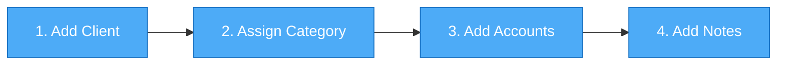
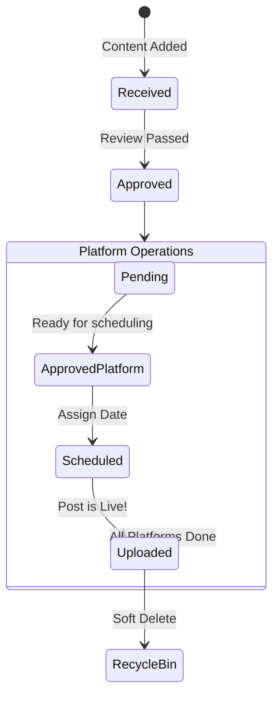

# SMCO-Hub: The Complete User Guide 🚀

Welcome to the **Social Media Content Operations Hub (SMCO-Hub)**! 

Whether you're a new Admin, an Agency Manager, or an Operations Lead, this guide will walk you through exactly **how** to use every feature in the system to streamline your social media pipeline.

---

## What SMCO-Hub Is

SMCO-Hub is a local-first social media operations system.

**It does NOT:**
* create content
* automatically post content
* manage social media through APIs

**It DOES:**
* manage clients
* track content
* track accounts
* track scheduling
* organize media files
* maintain operational records

---

> [!TIP]
> **Pro Tip for Power Users**
> You can navigate the entire system quickly using the **Global Search Bar**. Click the search bar from anywhere in the app to instantly search for Clients, Content, or Social Accounts!

---

## 🎨 1. Dashboard & Navigation Center

The Dashboard is your morning command center. It gives you a real-time snapshot of your agency's health and operational backlog.

### **Reading the KPIs**
At the very top of the Dashboard, you'll see KPI Cards. These numbers are actionable:
* **Active Clients**: Total clients currently active.
* **Ready Content**: Content that is fully approved and waiting to be scheduled, or already scheduled.
* **Scheduled This Week**: Posts going live within the next 7 days.
* **Missed Posts**: Items that were scheduled for a past date but were never marked as "Uploaded".
* **Storage Used**: Total disk space occupied by your media files.

> [!NOTE]
> **Clickable Metrics**: Click on the **Ready Content** or **Missed Posts** cards to immediately jump to a pre-filtered list of exactly which content pieces need your attention!

### **Dashboard Alerts & Matrices**
* **Clients Requiring Attention (Health Alerts)**: The system tracks your clients' Health Scores (1-10). Any client dropping below a score of 5 will automatically appear in this alert panel.
* **Platform Completion Matrix**: Shows exactly how many of your active clients have an account configured for each platform (e.g., 90% have Instagram, but only 20% have Threads).

---

## 🔍 2. Global Search

Search has its own dedicated, omnipresent module.

### **How to Search**
1. Click the **Search Bar** at the top of the screen.
2. Type your query (minimum 2 characters).
3. The system simultaneously searches across:
   * **Clients** (by Name, Phone, Email)
   * **Content** (by Title, Hashtags)
   * **Accounts** (by Username/Handle)
4. Click on any categorized result to navigate directly to that specific Client Profile, Content Record, or Social Account tab!

---

## 👥 3. Managing Clients (CRM)

Your clients are the foundation of SMCO-Hub. Managing them effectively sets up your entire content pipeline for success.

### **Client Onboarding Flow**
Here is the recommended path for adding a new client to the system:



### **How to Add a New Client**
1. Navigate to the **Clients** tab using the left sidebar.
2. Click the blue **"+ Add Client"** button in the top right.
3. **Personal Info**: Enter their Full Name (required), Phone, Email, DOB, and Address.
4. **Taxonomy**: Select a primary **Category** (e.g., Fitness) and select any custom **Tags** (e.g., VIP).
5. Click **Save Client**.

### **How to Add Social Media Accounts**
Once a client is created, you must tell the system which platforms they are active on.
1. Click on the Client's card to open their **Client Details Page**.
2. Navigate to the **Accounts section** in the main window.
3. Click **Add Account**.
4. Select the **Platform** (e.g., Instagram).
5. Enter their exact **Username/Handle**.
6. *(Optional)* Store login credentials, recovery email, and recovery phone for operational reference. 
7. Click **Save Account**.

### **How to Archive a Client**
When an agency contract ends, do not delete the client! Instead, archive them.
1. Open the **Client Details Page**.
2. Click the **Actions (`...`)** menu.
3. Select **Archive Client**. 
**Archived Clients:**
* Disappear from active working views.
* Remain searchable via Global Search.
* Retain all accounts, internal notes, and content history.

---

## 🎬 4. Content Operations Pipeline

This is where the magic happens. The content pipeline tracks a post from a raw idea to a published asset.

### **The Content Lifecycle**


### **How to Log New Content**
1. Navigate to the **Content** tab.
2. Click **"+ Add Content"**.
3. Select the **Client**.
4. Provide a **Title**, and select the **Type** (`Image`, `Carousel`, `Reel`, `Video`, `Story`, `Shorts`, `Text`, `Other`).
5. Add the **Caption**, **Hashtags**, and **Source Links**.
6. Click **Save Content**. The overarching global status starts as **"Received"**.

### **How to Upload Physical Media**
1. Open the **Content Details Page**.
2. Scroll to the **Media Files section**.
3. **Drag & Drop** your files directly into the upload zone, or click to browse.
4. The files will upload and appear in the gallery.

### **How to Schedule and Publish**
1. Scroll to the **Platforms section** on the Content Details Page.
2. Click **Manage Platforms** and check the boxes for the networks this post should go to.
3. Click the **Edit (Pencil)** icon next to a specific platform.
4. **To Schedule**: Change the status from `Pending` -> `Approved` -> **`Scheduled`**, select the target date/time, and click Save.
5. **To Publish**: Once you actually post the content manually on the real social network, come back, change the status to **`Uploaded`**, and paste the live URL into the box.

---

## 📅 5. Timeline & Scheduling

The Timeline is a dedicated module for viewing your agency's entire upcoming calendar.

* **Upcoming Posts**: See exactly what is scheduled to go live today, tomorrow, and next week.
* **Missed Posts**: Easily spot content that missed its scheduled window.
* **Filters**: Filter the entire calendar by specific Clients or specific Platforms.
* **Direct Navigation**: Click any event on the timeline to instantly open the corresponding Content record and execute the upload.

---

## 💾 6. Storage Management & Disk Health

Media files consume hard drive space. The Storage module helps you monitor it.

### **Where Files Are Stored**
Unlike most apps that throw files into a messy folder, SMCO-Hub uses a highly structured, human-readable architecture directly on the server hard drive:
```text
storage/
└── Rahul Sharma/
    └── CNT-A123_Summer Reel/
         ├── video.mp4
         └── thumbnail.jpg
```
**Benefits of this structure:**
* Extremely human-readable.
* Easy to manually recover a file directly from the hard drive.
* Easy to back up just the media folders manually.

### **Fixing "Missing File" Errors**
If someone bypasses the app and deletes a video file directly from the computer's hard drive, the database will throw an error.
1. Navigate to **Settings > Storage**.
2. Look at the **Missing Files** panel.
3. The system will list database records pointing to files that no longer exist on disk.
4. Click **"Remove Reference"**. This safely tells the database to stop looking for the deleted file, preventing crashes.

---

## 🗑️ 7. The Recycle Bin

SMCO-Hub uses a "Soft Delete" mechanism to prevent disastrous accidental clicks.

### **How to Recover Deleted Items**
1. Navigate to the **Recycle Bin** (bottom of the left sidebar).
2. Click the green **Restore** icon next to an item to instantly return it to the Content board.

### **How to Hard Delete (Empty Trash)**
1. Inside the Recycle Bin, locate the item.
2. Click the red **Trash** icon. 
3. **Confirm** the deletion. The system will attempt to permanently remove the database record and any remaining physical media files from the disk.

---

## 🔐 8. Backups & Disaster Recovery

Your agency's data is critical. SMCO-Hub makes it incredibly simple to export and restore everything.

### **How to Generate a Backup**
1. Navigate to **Settings > System & Data**.
2. Click **Export Database Backup**.
3. The system will compile all Text Data (JSON) and download a `backup.zip` file. *(Media files are specifically excluded so the backup remains extremely fast and lightweight).*

### **How to Restore from a Backup**

> [!CAUTION]
> **RESTORE WARNING**
> Restoring replaces your current database entirely! Always create a fresh backup before attempting to restore an older one.

1. Navigate to **Settings > System & Data**.
2. Click **Restore from Backup** and upload your `backup.zip` file.
3. **Review Summary**: The system will parse the ZIP and show you what it contains (e.g., "40 Clients found").
4. **Confirm**: Type `RESTORE` to execute the database overwrite.

---

## 📈 9. Monthly Snapshots

Snapshots freeze your agency's numbers in time so you can track growth.

### **How to Track Growth**
1. Navigate to **Settings > System & Data**.
2. Click **Generate Snapshot**. The system records your Active Client count, Content count, and Storage Used for the current month.
3. You can click this button multiple times in a month; it will simply **upsert** (update) the current month's record rather than creating duplicates.
4. Compare previous months to prove agency growth to stakeholders.
